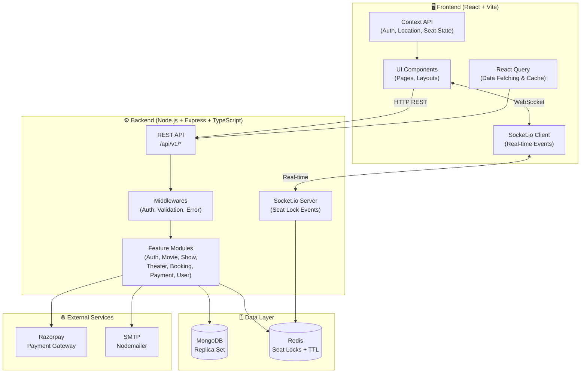
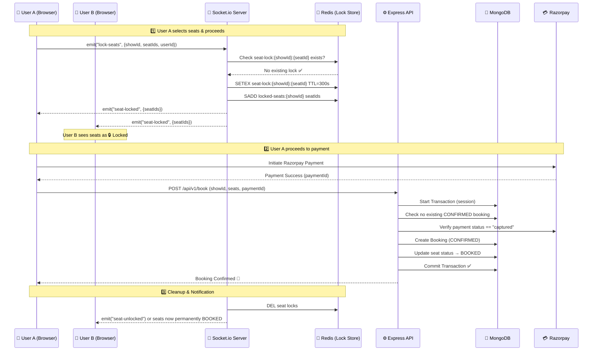

# 🎬 BookMyScreen — Movie Booking System (MERN Stack)

Welcome to the **BookMyScreen** tutorial series – your ultimate guide to building a **full-stack movie ticket booking system** using **React**, **Node.js**, **MongoDB**, and **Express.js**.

This system includes advanced features like **concurrent seat locking**, **real-time UI updates**, and **theatre-wise show grouping** – inspired by platforms like **BookMyShow**.

---

## ⚠️ Important Note (Must Read Before Using Code)

> 🚫 **Please do NOT blindly copy-paste the code from this project.**

This is a **complex, real-world full-stack system** involving:
- Concurrent seat booking logic with Redis-based locking
- Real-time updates via WebSockets (Socket.io)
- Backend + Frontend tight integration
- MongoDB Transactions (Replica Set required)
- Structured, modular architecture

👉 If you directly copy the code, you may face:
- ❌ Errors during setup
- ❌ Confusion in understanding the flow
- ❌ Issues in execution and debugging

---

### 💡 Why this matters?

This project is designed to help you:
- Think like a real developer 🧠
- Understand system design + architecture
- Learn how real booking systems handle concurrency and race conditions

👉 Following the tutorial will ensure **smooth execution + deep understanding**

---

## 📺 Watch the Full Playlist

👉 [YouTube – Programming with Amrit](https://www.youtube.com/@ProgrammingWithAmrit)

---

## 🧰 Tech Stack

| Layer | Technology |
|---|---|
| **Frontend** | React 19, Vite, Tailwind CSS 4, React Router, React Query, Axios |
| **Backend** | Node.js, Express 5, TypeScript |
| **Database** | MongoDB (Replica Set) with Mongoose ODM |
| **Caching / Locking** | Redis (ioredis) – Temporary seat locks with TTL |
| **Real-time** | Socket.io (server) + Socket.io-client (frontend) |
| **Payments** | Razorpay Payment Gateway |
| **Email** | Nodemailer + Mailgen (OTP & booking confirmations) |
| **Validation** | Zod (schema validation) |
| **Auth** | JWT (Access + Refresh Tokens) with HTTP-Only Cookies |
| **Containerization** | Docker Compose (MongoDB Replica Set) |

---

## ✨ Key Features

- 🔐 **OTP-Based Authentication** – Email OTP login with hashed verification, JWT access/refresh token rotation, HTTP-only cookies
- 🎥 **Movie Catalog** – Browse movies, view details, formats, durations, posters
- 🏛️ **Theater & Show Management** – Theatre-wise show grouping with date/time selection
- 💺 **Real-Time Seat Selection** – Interactive seat layout with live availability updates across all connected users
- 🔒 **Concurrent Seat Locking** – Redis-backed 5-minute temporary locks to prevent double-booking
- 💳 **Razorpay Payment Integration** – Secure payment flow with server-side verification
- 📧 **Email Confirmations** – Automated booking confirmation emails via Nodemailer
- 🗄️ **MongoDB Transactions** – ACID-compliant multi-document transactions using Replica Set
- 👤 **User Profiles** – View booking history with ticket details

---

## 🏗️ System Architecture

> 📐 Full architecture diagram available on [Eraser.io](https://app.eraser.io/workspace/kVaH7d9rIdoOgqli1DRR)

### High-Level Architecture



---

### 🔒 Real-Time Seat Locking Flow (Sequence Diagram)

This is the **core innovation** of BookMyScreen — preventing double-booking using Redis temporary locks + Socket.io broadcasts.



#### What happens on failure?

| Scenario | Behavior |
|---|---|
| **Payment fails** | User returns to seat layout, emits `unlock-seats`. Redis locks are removed. Seats become available again for everyone. |
| **User abandons checkout** | Redis TTL (5 minutes) auto-expires the lock keys. Seats are automatically freed. |
| **User disconnects** | Socket disconnects. Redis TTL handles cleanup — no manual unlock needed. |
| **Race condition (two users, same seat)** | MongoDB transaction + `findOne` check rejects the second booking. Redis lock prevents most conflicts before they reach the DB. |

---

## 📂 Project Structure

```
BookMyScreen/
│
├── bms-frontend/                    # React Frontend (Vite + Tailwind CSS)
│   ├── src/
│   │   ├── apis/                    # Axios API wrappers
│   │   │   ├── axiosWrapper.js      # Base Axios instance
│   │   │   └── index.js             # All API call functions
│   │   ├── assets/                  # Static assets (images, icons)
│   │   ├── components/
│   │   │   ├── auth/                # Sign-in modal, OTP input
│   │   │   ├── movies/              # Movie cards, lists
│   │   │   ├── profile/             # User profile & booking history
│   │   │   ├── seat-layout/         # Seat grid, header, footer
│   │   │   └── shared/              # Header, Footer, Banner, Loader
│   │   ├── context/
│   │   │   ├── AuthContext.jsx      # Authentication state
│   │   │   ├── LocationContext.jsx  # User location/state
│   │   │   └── SeatContext.jsx      # Selected seats state
│   │   ├── hooks/
│   │   │   ├── useCountdown.jsx     # Timer countdown hook
│   │   │   ├── useCurrentStateLocation.js
│   │   │   └── useLoadUser.js       # Auto-login on page load
│   │   ├── pages/
│   │   │   ├── Home.jsx             # Landing page
│   │   │   ├── Movies.jsx           # Movie listing
│   │   │   ├── MovieDetails.jsx     # Movie info + show times
│   │   │   ├── SeatLayout.jsx       # 💺 Interactive seat selection
│   │   │   ├── Checkout.jsx         # 💳 Payment & booking
│   │   │   └── Profile.jsx          # 👤 User dashboard
│   │   ├── utils/                   # Socket instance, helpers
│   │   ├── App.jsx                  # Route definitions
│   │   └── main.jsx                 # Entry point
│   └── package.json
│
├── bms-backend/                     # Node.js + Express Backend (TypeScript)
│   ├── src/
│   │   ├── config/
│   │   │   ├── config.ts            # Environment variables
│   │   │   ├── db.ts                # MongoDB connection
│   │   │   └── redis.ts             # Redis connection
│   │   ├── middlewares/
│   │   │   ├── auth.middleware.ts    # JWT verification
│   │   │   ├── error.middleware.ts   # Global error handler
│   │   │   └── validate.ts          # Zod schema validation
│   │   ├── modules/
│   │   │   ├── auth/                # 🔐 OTP, JWT tokens, login/logout
│   │   │   ├── booking/             # 🎟️ Create booking, verify payment, transactions
│   │   │   ├── movie/               # 🎬 Movie CRUD
│   │   │   ├── payment/             # 💳 Razorpay order creation
│   │   │   ├── show/                # 🕐 Show times, seat layout, availability
│   │   │   ├── theater/             # 🏛️ Theater management
│   │   │   └── user/                # 👤 User profile
│   │   ├── routes/
│   │   │   └── index.ts             # Central route registry
│   │   ├── scripts/
│   │   │   ├── seed-movies.ts       # 🌱 Seed movie data
│   │   │   ├── seed-theaters.ts     # 🌱 Seed theater data
│   │   │   └── seed-shows.ts        # 🌱 Seed show data
│   │   ├── socket/
│   │   │   └── sockethandlers.ts    # 🔌 join-show, lock-seats, unlock-seats
│   │   ├── utils/                   # Helpers (booking ref, email, etc.)
│   │   ├── app.ts                   # Express app setup
│   │   └── server.ts                # HTTP + Socket.io server bootstrap
│   └── package.json
│
├── docker-compose.yml               # 🐳 MongoDB Replica Set setup
├── SETUP_GUIDE.md                   # Detailed setup walkthrough
├── MONGO.TXT                        # Why Replica Set is needed for transactions
└── README.md                        # 📖 You are here
```

---

## 🔌 API Endpoints

All routes are prefixed with `/api/v1/`

| Module | Method | Endpoint | Description |
|---|---|---|---|
| **Auth** | POST | `/auth/send-otp` | Send OTP to email |
| | POST | `/auth/verify-otp` | Verify OTP & login |
| | POST | `/auth/logout` | Logout (clear cookies) |
| | GET | `/auth/refresh` | Refresh access token |
| **Movies** | GET | `/movies` | Get all movies |
| **Theaters** | GET | `/theaters` | Get all theaters |
| **Shows** | GET | `/shows` | Get shows (by movie/theater/date) |
| | GET | `/shows/:id` | Get show by ID (with seat layout) |
| **Payment** | POST | `/payment/create-order` | Create Razorpay order |
| **Booking** | POST | `/book` | Create confirmed booking |
| | GET | `/book` | Get user's bookings |
| **Users** | GET | `/users/profile` | Get logged-in user profile |

---

## 🚀 Getting Started

### Prerequisites

- **Node.js** (v18+)
- **MongoDB** + MongoDB Compass
- **Redis** (running locally or via Docker)
- **Docker & Docker Compose** (for MongoDB Replica Set)
- **Razorpay Account** (for payment integration)

---

### Step 1: Start MongoDB Replica Set (Required for Transactions)

> ⚠️ MongoDB standalone does NOT support multi-document transactions. You **must** use a Replica Set. See [MONGO.TXT](./MONGO.TXT) for why.

```bash
docker-compose up -d
```

This starts a **MongoDB 6 Replica Set** with automatic initialization.

---

### Step 2: Backend Setup

```bash
cd bms-backend
npm install
```

Create a `.env` file (refer to [.env.example](./bms-backend/.env.example)):

```env
PORT=9000
MONGO_CONNECTION_STRING=mongodb://localhost:27017/bookmyscreen
NODEMAILER_EMAIL=your-email@gmail.com
NODEMAILER_PASSWORD=your-app-password
HASH_SECRET=your-hash-secret
ACCESS_TOKEN_SECRET=your-access-secret
REFRESH_TOKEN_SECRET=your-refresh-secret
FRONTEND_URL=http://localhost:5173
RAZORPAY_API_KEY=your-razorpay-key
RAZORPAY_SECRET_KEY=your-razorpay-secret
REDIS_HOST=127.0.0.1
REDIS_PORT=6379
```

Seed the database:

```bash
npm run seed:movies
npm run seed:theaters
npm run seed:shows
```

Start the server:

```bash
npm run dev    # Runs on http://localhost:9000
```

---

### Step 3: Frontend Setup

```bash
cd bms-frontend
npm install
npm run dev    # Runs on http://localhost:5173
```

---

### Step 4: Open in Browser 🎉

| Service | URL |
|---|---|
| Frontend | [http://localhost:5173](http://localhost:5173) |
| Backend API | [http://localhost:9000](http://localhost:9000) |

> 📖 For a more detailed walkthrough, check [SETUP_GUIDE.md](./SETUP_GUIDE.md)

---

## 🧠 Key Architecture Decisions

| Decision | Why |
|---|---|
| **Redis for seat locking** (not MongoDB) | Sub-millisecond reads, built-in TTL auto-expiry, no DB polling needed |
| **Socket.io for real-time** | Bi-directional communication, room-based broadcasting per show |
| **MongoDB Replica Set** | Required for multi-document ACID transactions during booking |
| **JWT in HTTP-Only Cookies** | Prevents XSS attacks on tokens; refresh token rotation for security |
| **OTP-based login** (no passwords) | Simpler auth flow, no password storage, email-verified users |
| **Zod validation** | Runtime type-safe request validation on the backend |

---

## 🤝 Contributing

This is a tutorial project. Feel free to fork, learn, and build upon it!

If you find a bug or want to improve something:
1. Fork the repository
2. Create a feature branch (`git checkout -b feature/amazing-feature`)
3. Commit your changes (`git commit -m 'Add amazing feature'`)
4. Push to the branch (`git push origin feature/amazing-feature`)
5. Open a Pull Request

---

## 📄 License

This project is licensed under the ISC License.

---

## 👨‍💻 Author

**Amrit Maurya** — [Programming with Amrit](https://www.youtube.com/@ProgrammingWithAmrit)

---

> ⭐ If this project helped you, give it a star on GitHub!
